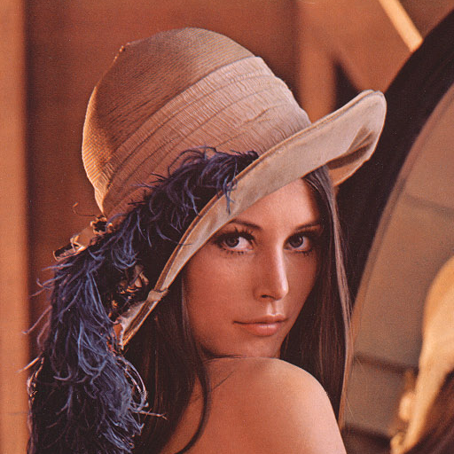

Boundary Pruning
===========================================

These are tools to partition a space into similar regions based on the relative similarity of different areas as well as the complexity of the boundary.  

Algorithm
----------

To do so, the space is first filled with all boundaries so that there is a boundary between every pixel of the field.  Boundary costs are then calculated based on a number of methods.  Then, the highest cost boundary is removed until a threshold number of boundaries is reached.  This cutoff is determined by the absolute energy of the last removed boundary or the fraction of boundaries remaining.  

Methods of determining cost include:

- **Inhomogeneity**: cost determined by the change in field values across boundaries.  
- **Perimeter to Area**: take the perimeter / area ratio as the cost, determing fully the polygons formed by all boundaries.
- **Both**: use both to determine the cost.  This requires a constant to weight the two contributions appropriately.  

Example
--------

Let's look at how to use the class.  As an example, we will exmploy the stereotypical portrait named 'Lena' often used in the graphics industry.  

.. code-block:: python
   :linenos:

   # standard imports
   import scipy
   from scipy.misc import imread

   # the boundary pruning class
   import BoundaryPruningMethod as BPM

   # open up lena, and set the output prefix
   data   = imread("lena.jpg")
   output = "output/lena_pruning"

   J = 0.1
   N = data.shape[0]

   # set up the initial boundaries
   system = BPM.Initialization(N, data)
   boundaries,clusters = system.GenerateClustersFromEverySite() 

   # perform the actual clustering, this time with both score types
   clustering = BPM.ClusteringMixed(N, data, boundaries, clusters, J)
   clustering.Run(output)
   clustering.GetReconstructionWithBoundary(N, data, output)

The output from this simple example is 

    |0| |1|

The mixture of inhomogeneity to perimeter cost can be fine tuned using the parameter J.  Lower values give rise to more twisty polygon boundaries.  

Module Listing
--------------------------------------

.. automodule:: BoundaryPruningMethod
	:members:

