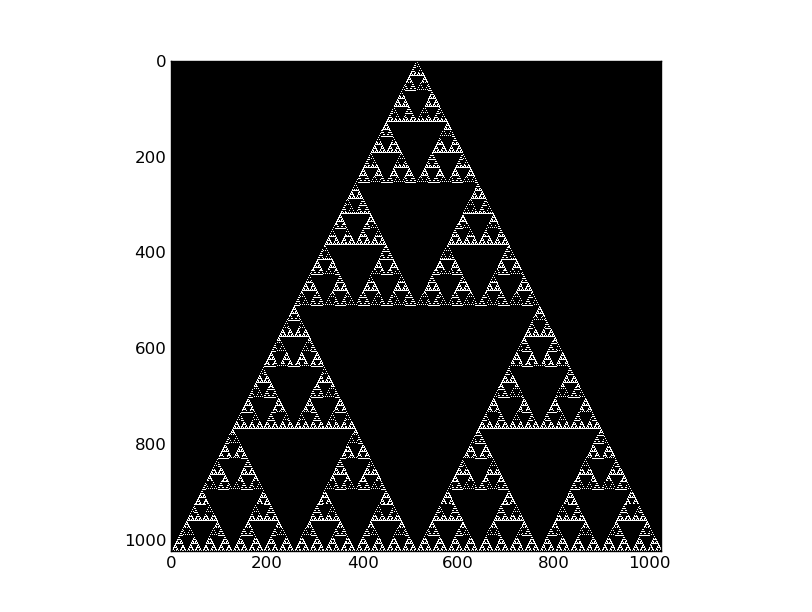
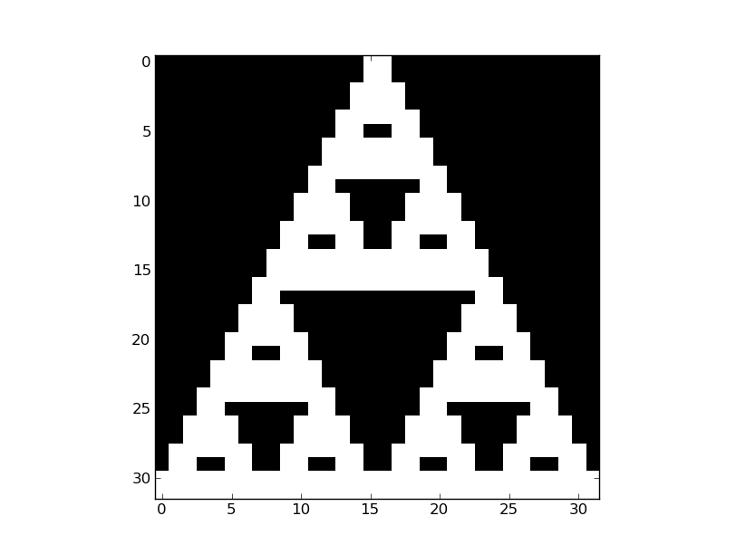
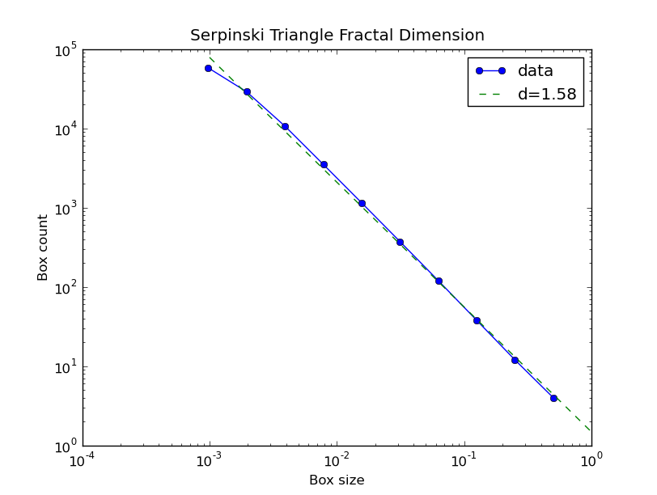

Box Counting Method
===========================================

Package Overview
------------------------------------

Performs standard box counting techniques to a set of floating point data, first converting the data to binary using a cutoff.  For example, it was applied to the Serpinski triangle as an image for the following result:

Module Listing
--------------------------------------

.. automodule:: BoxCountingMethod
	:members:

